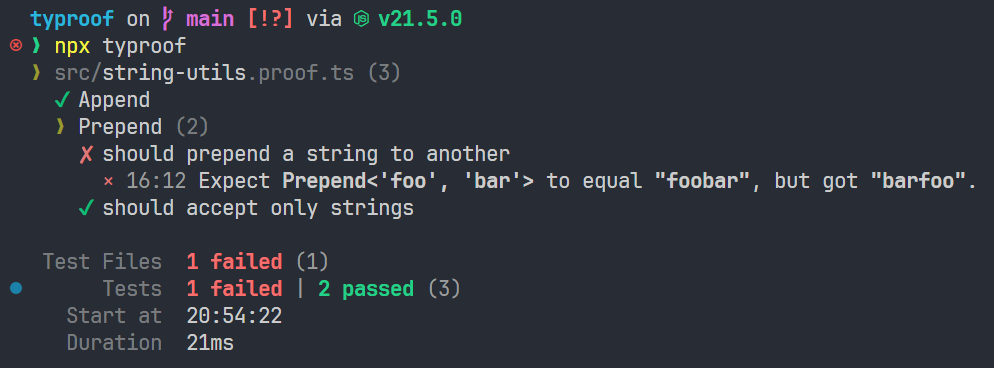

# Typroof

> 🚀 **Revolutionize** your TS **type testing** with a fast, smooth, and flexible **WYSIWYG** experience!


## Installation

```shell
npm install --save-dev typroof
# Or
yarn add -D typroof
# Or
pnpm add -D typroof
```

## Overview

This tool lets you write tests for your TypeScript type definitions just like what you would do for your runtime code like Jest, Vitest, etc. It provides similar APIs like `test`, `expect`, `describe` in Jest, but for your type definitions.

By default, these test files should end with `.proof.ts` or be placed in a `proof/` directory. They will not be really executed, but instead be parsed and statically analyzed against your type definitions. Special constructs such as `expect<Append<'foo', 'bar'>>().to(equal<'foobar'>)` or `expect<Append<'foo', 42>>().to(error)` will be parsed and analyzed to see if they are valid.

The `typroof` CLI will search for these test files and run static analysis on them. It will then report the results to the console.

```shell
[npx] typroof [path]
```

Use `typroof --help` for usage information.

## Usage

Assume that you write a `string-utils.ts` file with the following type definitions:

```typescript
export type Append<S extends string, Ext extends string> = `${S}${Ext}`;
export type Prepend<S extends string, Start extends string> = `${Start}${S}`;

export const append = <S extends string, Ext extends string>(s: S, ext: Ext): Append<S, Ext> =>
  `${s}${ext}`;
```

Then you can write a `string-utils.proof.ts` file to test them:

```typescript
import { describe, equal, error, expect, extend, it, test } from 'typroof';

import { append } from './string-utils';

import type { Append, Prepend } from './string-utils';

test('Append', () => {
  expect<Append<'foo', 'bar'>>().to(equal<'foobar'>);
  expect<Append<'foo', 'bar'>>().to(extend<string>);
  expect<Append<'foo', 'bar'>>().not.to(extend<number>);
  expect(append('foo', 'bar')).to(equal('foobar' as const));
});

describe('Prepend', () => {
  it('should prepend a string to another', () => {
    expect<Prepend<'foo', 'bar'>>().to(equal<'foobar'>);
  });

  it('should accept only strings', () => {
    // @ts-expect-error - should trigger error
    expect<Prepend<42, 43>>().to(error);
  });
});
```

You can see that the APIs are very similar to Jest. The `test` function and its alias `it` to create a test case. The `describe` function to create a test suite (group of test cases). The `expect` function to create an assertion. The `toEqual` function to assert that the type is equal to the expected type.

You may notice that we use two different syntaxes for the `equal` matcher. You can either pass the expected type as a type argument, or pass it as a value argument. The former is useful when testing generic types, while the latter will be useful when testing the return type of a function. You can choose whichever you like. Even `expect` itself can use a value argument instead of a type argument, such as `expect('foobar').to(equal<'foobar'>)`.

Then run `typroof` to test your type definitions:



The `equal` matcher strictly checks if the type is equal to the expected type. If you want to check if the type is assignable to the expected type, you can use the `extend` matcher:

```typescript
expect<Append<'foo', 'bar'>>().to(extend<string>);
```

## Matchers

Matchers are indicators that can be used via `expect<T>(x?: T).to(matcher<...>)` or `expect<T>(x?: T).not.to(matcher<...>)` to assert the type. Typroof provides some built-in matchers, and you can also create your own matchers (see [Custom Matchers](#custom-matchers)).

For example:

```typescript
expect<Append<'foo', 'bar'>>().to(equal<'foobar'>);
// @ts-expect-error - The `error` matcher will handle `@ts-expect-error` comments correctly
expect<Append<1, 2>>().to(error);
expect<Append<'foo', 'bar'>>().not.to(beAny);
expect(append('foo', 'bar')).to(extend<string>);
expect('baz' as const).to(equal('baz' as const));
```

The actual type to test can either be passed as a type argument to `expect`, or passed as a value argument to `expect`.The former is useful when testing generic types, while the latter will be useful when testing the return type of a function. You can choose whichever you like.

The following is a list of built-in matchers. Remember that you can also use `expect.not` to negate them.

### `error`

Expect a pre emitted diagnostic between the start and end of the given type.

### `equal<U>(y?: U)`

Expect the type to be equal to the given type.

### `beAny`

Expect the type to be `any`.

### `beNever`

Expect the type to be `never`.

### `beNull`

Expect the type to be `null`.

### `beUndefined`

Expect the type to be `undefined`.

### `beNullish`

Expect the type to be `null`, `undefined` or `null | undefined`.

### `matchBoolean`

Expect the type to be `true`, `false` or `boolean`.

### `beTrue`

Expect the type to be `true`.

### `beFalse`

Expect the type to be `false`.

### `extend<U>(y?: U)`

Expect the type to be assignable to the given type (i.e. the given type should be a supertype of the type).

**Warning:** In TypeScript, `any` is both a subtype and a supertype of all other types. Therefore, `expect<string>().to(extend<any>)` and `expect<any>().to(extend<string>)` will both pass. The exception is `never`, which is not assignable to any type (thus `expect<any>().to(extend<never>)` fails). Keep this in mind, as it may lead to unexpected results when working with `any` or `never`. Use `strictExtend` for a stricter version that fails if either the type or the given type is `never` or `any`.

### `strictExtend<U>(y?: U)`

Like `extend`, but fails if either the type or the given type is `never` or `any`.

### `cover<U>(y?: U)`

Expect the given type to be assignable to the type (i.e. the given type should be a subtype of the type).

**Warning:** In TypeScript, `any` is both a subtype and a supertype of all other types. Therefore, `expect<string>().to(cover<any>)` and `expect<any>().to(cover<string>)` will both pass. The exception is `never`, which is not assignable to any type (thus `expect<never>().to(cover<any>)` fails). Keep this in mind, as it may lead to unexpected results when working with `any` or `never`. Use `strictCover` for a stricter version that fails if either the type or the given type is `never` or `any`.

### `strictCover<U>(y?: U)`

Like `cover`, but fails if either the type or the given type is `never` or `any`.

## Configuration

You can create a `typroof.config.ts` file in the root directory of your project to configure Typroof. It should export the configuration object. Typroof exports a `defineConfig` function to help you define the configuration object.

```typescript
// typroof.config.ts
import { defineConfig } from 'typroof/config';

export default defineConfig({
  testFiles: '**/*.proof.ts',
});
```

Don't forget to add your config file to `tsconfig.json`.

Typroof provides type definitions for the configuration object, so you can get type hints in your editor.

You can use either `.ts`, `.mts`, `.cts`, `.js`, `.mjs` or `.cjs` as the extension of the config file. The priority is `.ts` > `.mts` > `.cts` > `.js` > `.mjs` > `.cjs`.

## API

You can invoke the `typroof` CLI directly, or use the `typroof` function in your code.

```typescript
import typroof, { formatGroupResult, formatSummary } from 'typroof';

const startedAt = new Date();
const results = await typroof();
const finishedAt = new Date();

for (const result of results) {
  console.log(formatGroupResult(result.rootGroupResult));
  console.log();
}
console.log(
  formatSummary({ groups: results.map((r) => r.rootGroupResult), startedAt, finishedAt }),
);
```

## Custom Matchers

Matchers are just indicators to tell Typroof how to assert the type. The process actually involves two steps: The type level validation and the code analysis using [ts-morph](https://github.com/dsherret/ts-morph).

Take a look at how the `equal` matcher is implemented:

```typescript
import { match, registerAnalyzer } from 'typroof';

// `equal` is a matcher that takes a type argument.
// If no argument is needed, you can simply use `match<'matcherName'>()`
// instead of a function.
export const equal = <U>(y?: U) => match<'equal', U>();

/**
 * Check whether `T` is equal to `U`.
 * It is a utility type used in the type level validation step.
 */
type Equals<T, U> = (<G>() => G extends T ? 1 : 2) extends <G>() => G extends U ? 1 : 2
  ? true
  : false;

// Define how the type level validation step works.
// If type level validation is the only thing you need to do (e.g., `equal`),
// it should return a boolean type.
// Otherwise, it should return a `ToAnalyze<SomeType>`, e.g. `error` returns
// `ToAnalyze<never>`, the `ToAnalyze` means to determine whether the assertion
// passed or not needs further code analysis. You can pass any type to
// `ToAnalyze` for the code analysis step to use, but here `error` does not need it.
declare module 'typroof' {
  interface Validator<T, U> {
    // Here `equal` is the name of the matcher,
    // it must be the same as that in `match<'equal'>()`.
    equal: Equals<T, U>;
  }
}

// The `registerToEqual` function is called somewhere before code analysis is executed.
// If you need to define custom matchers, you should call the corresponding `registerTo...`
// function first — The `typroof.config.ts` file is a good place to do this.
export const registerToEqual = () => {
  // If it is a type level only matcher (i.e. The related validator returns a boolean type),
  // the third argument is a boolean indicating whether the validation step is passed.
  // Otherwise (i.e. The related validator returns a `ToAnalyze<SomeType>`), the third
  // argument is a ts-morph `Type` object representing the type to analyze, e.g., `error`
  // returns `ToAnalyze<never>`, so the third argument is a `Type` object representing `never`.
  registerAnalyzer('equal', (actual, expected, passed, { not }) => {
    if (passed) return;

    // Here `equal` is a type level only assertion, so we just need to report the error.
    // But you can do anything you want here, e.g., `error` checks if the type emits an
    // error. The fourth argument provides necessary metadata for you to achieve almost
    // anything you can via ts-morph.

    const actualText = chalk.bold(actual.text);
    const expectedType = chalk.bold(expected.getText());
    const actualType = chalk.bold(actual.type.getText());

    // Throw a string to report the error.
    throw (
      `Expect ${actualText} ${not ? 'not ' : ''}to equal ${expectedType}, ` +
      `but got ${actualType}.`
    );
  });
};
```

And that is all. As you see here, it is really easy to create custom matchers, and highly customizable powered by ts-morph.

Take a look at how `error` is implemented to see how powerful it is:

```typescript
import { match, registerAnalyzer } from 'typroof';
import type { ToAnalyze } from 'typroof';

export const error = match<'error'>();

declare module 'typroof' {
  interface Validator<T, U> {
    error: ToAnalyze<never>;
  }
}

export const registerToError = () => {
  registerAnalyzer('error', (actual, _1, _2, { diagnostics, not, statement }) => {
    const diagnostic = diagnostics.find((diagnostic) => {
      const start = diagnostic.getStart();
      if (!start) return false;
      const length = diagnostic.getLength();
      if (!length) return false;
      const end = start + length;
      return start >= actual.node.getStart() && end <= actual.node.getEnd();
    });

    const triggeredError =
      !!diagnostic ||
      // Check if the error is suppressed by `@ts-expect-error`
      statement.getLeadingCommentRanges().some(
        (range) =>
          range
            .getText()
            .replace(/^\/\*+\s*/, '')
            .replace(/^\/\/\s*/, '')
            .startsWith('@ts-expect-error') &&
          !diagnostics.find((diagnostic) => diagnostic.getStart() === range.getPos()),
      );

    if (not ? triggeredError : !triggeredError) {
      const actualText = chalk.bold(actual.text);
      throw (
        `Expect ${actualText} ${not ? 'not ' : ''}to trigger error, ` +
        `but ${not ? 'did' : 'did not'}.`
      );
    }
  });
};
```

If you like, you can even define a matcher to check whether JSDoc information is correctly reserved through a series of really complex generics.

It is also possible to create an extension library for Typroof, you can guide your users to execute the `registerTo...` functions provided in your library and import validator definitions in their `typroof.config.ts` file.
