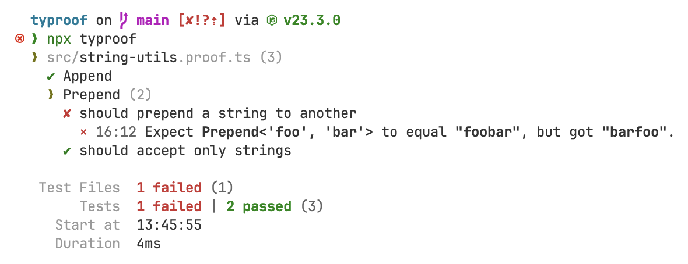

<h1 align="center">Typroof</h1>

TypeScript **type testing** with a fast **CLI** tool and a smooth **WYSIWYG editor experience**.

[](https://www.npmjs.com/package/typroof)
[](https://www.npmjs.com/package/typroof)
[](https://github.com/Snowflyt/typroof/actions/workflows/ci.yml)
[](https://github.com/Snowflyt/typroof)

https://github.com/user-attachments/assets/53aa8f97-c580-428e-89b2-2d07d1c5680d

## Installation

```shell
npm install --save-dev typroof
```

## Overview

This tool lets you write tests for your TypeScript type definitions just like what you would do for your runtime code like Jest, Vitest, etc. It provides similar APIs like `test`, `expect`, `describe` in Jest, but for your type definitions.

By default, these test files should end with `.proof.ts` or be placed in a `proof/` directory. They will not be really executed, but instead be parsed and statically analyzed against your type definitions. Special constructs such as `expect<Append<'foo', 'bar'>>().to(equal<'foobar'>)` or `expect<Append<'foo', 42>>().to(error)` will be parsed and analyzed to see if they are valid.

The `typroof` CLI will search for these test files and run static analysis on them. It will then report the results to the console.

```shell
[npx] typroof [path]
```

Use `typroof --help` for usage information.

## Usage

Assume that you write a `string-utils.ts` file with the following type definitions:

```typescript
export type Append<S extends string, Ext extends string> = `${S}${Ext}`;
export type Prepend<S extends string, Start extends string> = `${Start}${S}`;

export const append = <S extends string, Ext extends string>(s: S, ext: Ext): Append<S, Ext> =>
  `${s}${ext}`;
```

Then you can write a `string-utils.proof.ts` file to test them:

```typescript
import { describe, equal, error, expect, extend, it, test } from 'typroof';

import { append } from './string-utils';

import type { Append, Prepend } from './string-utils';

test('Append', () => {
  expect<Append<'foo', 'bar'>>().to(equal<'foobar'>);
  // If you write an assertion that fails, you can immediately see the error message by TypeScript:
  // expect<Append<'foo', 'bar'>>().to(equal<'foo'>);
  // //                                ~~~~~~~~~~~~
  // //            Argument of type '...' is not assignable to parameter
  // //         of type '"Expect `'foobar'` to equal `'foo'`, but does not"'
  expect<Append<'foo', 'bar'>>().to(extend<string>);
  expect<Append<'foo', 'bar'>>().not.to(extend<number>);
  expect(append('foo', 'bar')).to(equal('foobar' as const));
});

describe('Prepend', () => {
  it('should prepend a string to another', () => {
    expect<Prepend<'foo', 'bar'>>().to(equal<'foobar'>);
  });

  it('should accept only strings', () => {
    // @ts-expect-error - should trigger error
    expect<Prepend<42, 43>>().to(error);
  });
});
```

You can see that the APIs are very similar to Jest. The `test` function and its alias `it` to create a test case. The `describe` function to create a test suite (group of test cases). The `expect` function to create an assertion. The `toEqual` function to assert that the type is equal to the expected type.

You may notice that we use two different syntaxes for the `equal` matcher. You can either pass the expected type as a type argument, or pass it as a value argument. The former is useful when testing generic types, while the latter will be useful when testing the return type of a function. You can choose whichever you like. Even `expect` itself can use a value argument instead of a type argument, such as `expect('foobar').to(equal<'foobar'>)`.

Then run `typroof` to test your type definitions:



The `equal` matcher strictly checks if the type is equal to the expected type. If you want to check if the type is assignable to the expected type, you can use the `extend` matcher:

```typescript
expect<Append<'foo', 'bar'>>().to(extend<string>);
```

## Matchers

Matchers are indicators that can be used via `expect<T>(x?: T).to(matcher<...>)` or `expect<T>(x?: T).not.to(matcher<...>)` to assert the type. Typroof provides some built-in matchers, and you can also create your own matchers (see [Plugin API](#plugin-api)).

For example:

```typescript
expect<Append<'foo', 'bar'>>().to(equal<'foobar'>);
// @ts-expect-error - The `error` matcher will handle `@ts-expect-error` comments correctly
expect<Append<1, 2>>().to(error);
expect<Append<'foo', 'bar'>>().not.to(beAny);
expect(append('foo', 'bar')).to(extend<string>);
expect('baz' as const).to(equal('baz' as const));
```

The actual type to test can either be passed as a type argument to `expect`, or passed as a value argument to `expect`.The former is useful when testing generic types, while the latter will be useful when testing the return type of a function. You can choose whichever you like.

The following is a list of built-in matchers. Remember that you can also use `expect.not` to negate them.

### `error`

Expect a pre emitted diagnostic between the start and end of the given type.

### `equal<U>(y?: U)`

Expect the type to be equal to the given type.

### `beAny`

Expect the type to be `any`.

### `beNever`

Expect the type to be `never`.

### `beNull`

Expect the type to be `null`.

### `beUndefined`

Expect the type to be `undefined`.

### `beNullish`

Expect the type to be `null`, `undefined` or `null | undefined`.

### `matchBoolean`

Expect the type to be `true`, `false` or `boolean`.

### `beTrue`

Expect the type to be `true`.

### `beFalse`

Expect the type to be `false`.

### `extend<U>(y?: U)`

Expect the type to be assignable to the given type (i.e. the given type should be a supertype of the type).

**⚠ Warning:** In TypeScript, `any` is both a subtype and a supertype of all other types. Therefore, `expect<string>().to(extend<any>)` and `expect<any>().to(extend<string>)` will both pass. The exception is `never`, which is not assignable to any type (thus `expect<any>().to(extend<never>)` fails). Keep this in mind, as it may lead to unexpected results when working with `any` or `never`. Use `strictExtend` for a stricter version that fails if either the type or the given type is `never` or `any`.

### `strictExtend<U>(y?: U)`

Like `extend`, but fails if either the type or the given type is `never` or `any`.

### `cover<U>(y?: U)`

Expect the given type to be assignable to the type (i.e. the given type should be a subtype of the type).

**⚠ Warning:** In TypeScript, `any` is both a subtype and a supertype of all other types. Therefore, `expect<string>().to(cover<any>)` and `expect<any>().to(cover<string>)` will both pass. The exception is `never`, which is not assignable to any type (thus `expect<never>().to(cover<any>)` fails). Keep this in mind, as it may lead to unexpected results when working with `any` or `never`. Use `strictCover` for a stricter version that fails if either the type or the given type is `never` or `any`.

### `strictCover<U>(y?: U)`

Like `cover`, but fails if either the type or the given type is `never` or `any`.

## Configuration

You can create a `typroof.config.ts` file in the root directory of your project to configure Typroof. It should export the configuration object. Typroof exports a `defineConfig` function to help you define the configuration object.

```typescript
// typroof.config.ts
import { defineConfig } from 'typroof/config';

export default defineConfig({
  testFiles: '**/*.proof.ts',
});
```

Don't forget to add your config file to `tsconfig.json`.

**⚠ Warning:** Make sure not to import value directly from `typroof` in your config file (use `typroof/config`, `typroof/plugin`, etc. instead), otherwise you may get circular dependencies error when Typroof is loading config.

Typroof provides type definitions for the configuration object, so you can get type hints in your editor.

You can use either `.ts`, `.mts`, `.cts`, `.js`, `.mjs` or `.cjs` as the extension of the config file. The priority is `.ts` > `.mts` > `.cts` > `.js` > `.mjs` > `.cjs`.

## API

You can invoke the `typroof` CLI directly, or use the `typroof` function in your code.

```typescript
import typroof, { formatGroupResult, formatSummary } from 'typroof';

const startedAt = new Date();
const results = await typroof();
const finishedAt = new Date();

for (const result of results) {
  console.log(formatGroupResult(result.rootGroupResult));
  console.log();
}
console.log(
  formatSummary({ groups: results.map((r) => r.rootGroupResult), startedAt, finishedAt }),
);
```

## Plugin API

Typroof supports plugins to extend its matchers.

Matchers are just indicators to tell Typroof how to assert the type. The process actually involves two steps: The type level validation and the code analysis using TypeScript compiler API.

Take a look at how the `equal` matcher is implemented:

```typescript
// `registerAnalyzer` is not actually exported,
// it is just an example to show how to create custom matchers.
import { match, registerAnalyzer } from 'typroof/plugin';
import type { Actual, Expected, Validator } from 'typroof/plugin';

// `equal` is a matcher that takes a type argument.
// If no argument is needed, you can simply use `match<'matcherName'>()`
// instead of a function.
export const equal = <U>(y?: U) => match<'equal', U>();

/**
 * Check whether `T` is equal to `U`.
 * It is a utility type used in the type level validation step.
 */
type Equals<T, U> =
  (<G>() => G extends T ? 1 : 2) extends <G>() => G extends U ? 1 : 2 ? true : false;

// Define how the type level validation step works.
// If type-level validation is the only thing you need to do (e.g., `equal`),
// it should be a `Validator` returning a boolean type.
// Otherwise, it should return a `ToAnalyze<SomeType>`, e.g. `error` returns
// `ToAnalyze<never>`, the `ToAnalyze` means to determine whether the assertion
// passed or not needs further code analysis. You can pass any type to
// `ToAnalyze` for the code analysis step to use, but here `error` does not need it.
declare module 'typroof/plugin' {
  interface ValidatorRegistry {
    // Here `equal` is the name of the matcher,
    // it must be the same as that in `match<'equal'>()`.
    equal: EqualValidator;
  }
}
// Use a type-level function (i.e. HKT) to define a type-level validator.
interface EqualValidator extends Validator {
  return: Equals<Actual<this>, Expected<this>>;
}

// The `registerToEqual` helper function should be called somewhere before code analysis is
// executed to register the corresponding analyzer for the `equal` matcher.
export const registerToEqual = () => {
  // The registered analyzer is called when the type-level validator does not evaluate to
  // `true` (i.e, `false` or `ToAnalyze<SomeType>`).
  // If the validator evaluates to `ToAnalyze<SomeType>`, the `SomeType` object will be
  // accessible as the `validationResult` property in the third argument of the analyzer
  // as a `Type<ts.Type>` object.
  // Here, since `equal` is a type-level only matcher, so the analyzer is only used to
  // report the error message, and `validationResult` is not used, but it can be useful
  // if you are implementing a matcher like `haveJSDoc` that needs to analyze the type
  // using TypeScript compiler API.
  registerAnalyzer('equal', (actual, expected, { not, typeChecker, validationResult }) => {
    // Here `equal` is a type-level only assertion, so we just need to report the error.
    // But you can do anything you want here, e.g., `error` checks if the type emits an
    // error. The fourth argument provides necessary metadata for you to achieve almost
    // anything you can via TypeScript compiler API.

    const actualText = `\x1b[1m${actual.text}\x1b[22m`; // Bold the text with ANSI escape codes
    const expectedType = `\x1b[1m${typeChecker.typeToString(expected)}\x1b[22m`;
    const actualType = `\x1b[1m{typeChecker.typeToString(actual.type)}\x1b[22m`;

    // Throw a string to report the error.
    throw (
      `Expect ${actualText} ${not ? 'not ' : ''}to equal ${expectedType}, ` +
      `but got ${actualType}.`
    );
  });
};
```

`Validator`s in Typroof are type-level functions (HKTs) compatible with the [hkt-core](https://github.com/Snowflyt/hkt-core) V1 standard, see [its documentation](https://github.com/Snowflyt/hkt-core) for more information.

And that is all. As you see here, it is really easy to create custom matchers, and highly customizable powered by ts-morph.

Typroof automatically generates a compile-time error message if the assertion fails:

```typescript
expect<Append<'foo', 'bar'>>().to(equal<'foo'>);
//                                ~~~~~~~~~~~~
//            Argument of type '...' is not assignable to parameter
//             of type "Validation failed: equal<'foobar', 'foo'>"
```

But if you want a more readable error message, you can change the validator to return a string instead of a boolean if the assertion fails:

```typescript
import type { Actual, Expected, IsNegated, Stringify, Validator } from 'typroof/plugin';

declare module 'typroof/plugin' {
  interface ValidatorRegistry {
    equal: EqualValidator;
  }
}
interface EqualValidator extends Validator {
  // `IsNegated<this>` is `true` if `.not` is used, otherwise `false`.
  return: IsNegated<this> extends false ?
    // If `.not` is not used, return a string as the error message if `T` is not equal to `U`
    Equals<Actual<this>, Expected<this>> extends true ?
      true
    : `Expect \`${Stringify<Actual<this>>}\` to equal \`${Stringify<Expected<this>>}\`, but does not`
  : // If `.not` is used, return a string as the error message if `T` is equal to `U`
  Equals<Actual<this>, Expected<this>> extends false ? false
  : `Expect the type not to equal \`${Stringify<Expected<this>>}\`, but does`;
}
```

Now let’s take a look at how `error` is implemented:

```typescript
import { match, registerAnalyzer } from 'typroof/plugin';

import type { ToAnalyze } from 'typroof/plugin';

export const error = match<'error'>();

declare module 'typroof/plugin' {
  interface ValidatorRegistry {
    error: ErrorValidator;
  }
}
interface ErrorValidator {
  return: ToAnalyze<never>;
}

export const registerToError = () => {
  registerAnalyzer('error', (actual, _expected, { diagnostics, not, sourceFile, statement }) => {
    // Check if a diagnostic error exists for this node
    const diagnostic = diagnostics.find((diagnostic) => {
      const start = diagnostic.start;
      if (start === undefined) return false;

      const length = diagnostic.length;
      if (length === undefined) return false;

      const end = start + length;
      const nodeStart = actual.node.getStart(sourceFile);
      const nodeEnd = actual.node.getEnd();

      return start >= nodeStart && end <= nodeEnd;
    });

    // Find @ts-expect-error comments that apply to this expression
    const findTSExpectError = () => {
      const sourceText = sourceFile.text;

      // 1. Check for leading comments directly before the statement
      const leadingComments =
        ts.getLeadingCommentRanges(sourceText, statement.getFullStart()) || [];

      // 2. Find any internal comments within the statement’s full text range
      // This helps with multi-line expressions that have inline comments
      const statementStart = statement.getFullStart();
      const statementEnd = statement.getEnd();
      const statementText = sourceText.substring(statementStart, statementEnd);

      // Track all potential comment positions
      const commentPositions: { start: number; end: number }[] = [
        ...leadingComments.map((c) => ({ start: c.pos, end: c.end })),
      ];

      // Scan the statement for possible comment starts
      let pos = 0;
      while (pos < statementText.length) {
        // Look for // comments
        if (statementText.substring(pos, pos + 2) === '//') {
          const startPos = statementStart + pos;
          let endPos = statementText.indexOf('\n', pos);
          if (endPos === -1) endPos = statementText.length;
          commentPositions.push({
            start: startPos,
            end: statementStart + endPos,
          });
          pos = endPos + 1;
          continue;
        }

        // Look for /* */ comments
        if (statementText.substring(pos, pos + 2) === '/*') {
          const startPos = statementStart + pos;
          const endPos = statementText.indexOf('*/', pos);
          if (endPos !== -1) {
            commentPositions.push({
              start: startPos,
              end: statementStart + endPos + 2,
            });
            pos = endPos + 2;
            continue;
          }
        }

        pos++;
      }

      // Check all comment positions for @ts-expect-error
      for (const { end, start } of commentPositions) {
        const commentText = sourceText.substring(start, end);
        if (commentText.includes('@ts-expect-error')) {
          // Ensure this @ts-expect-error is not already used by checking
          // if there’s a diagnostic that starts at this exact position
          const isUnused = !diagnostics.some(
            (d) => d.start === start && d.code === 2578, // TypeScript’s code for @ts-expect-error
          );
          if (isUnused) return true;
        }
      }

      return false;
    };

    // Check if error is triggered either by diagnostic or @ts-expect-error
    const triggeredError = !!diagnostic || findTSExpectError();

    if (not ? triggeredError : !triggeredError) {
      const actualText = bold(actual.text);
      throw (
        `Expect ${actualText} ${not ? 'not ' : ''}to trigger error, ` +
        `but ${not ? 'did' : 'did not'}.`
      );
    }
  });
};
```

So how to extend Typroof with your own matchers? The code below shows how to do it:

```typescript
// In your entry file, e.g., `index.ts` or `main.ts`.
declare module 'typroof/plugin' {
  interface ValidatorRegistry {
    beFoo: BeFooValidator;
  }
}
interface BeFooValidator extends Validator {
  // Define the return type of your validator
  return: IsNegated<this> extends false ?
    Actual<this> extends 'foo' ?
      true
    : `Expect \`${Stringify<Actual<this>>}\` to be \`'foo'\`, but does not`
  : Actual<this> extends 'foo' ? `Expect the type not to be \`'foo'\`, but does`
  : false;
}

// In your `typroof.config.ts`
import { defineConfig } from 'typroof/config';

import type { Plugin } from 'typroof/plugin';

// It is recommended to define the plugin as a factory function
const foo = (): Plugin => ({
  // `name` is required, and recommended to be named as `typroof-plugin-*`
  name: 'typroof-plugin-example',
  analyzers: {
    // Just like what you have seen in `registerAnalyzer`
    beFoo: (actual, _expected, { not, typeChecker }) => {
      const actualText = `\x1b[1m${actual.text}\x1b[22m`; // Bold the text with ANSI escape codes
      const expectedType = `\x1b[1m"foo"\x1b[22m`;
      const actualType = `\x1b[1m{typeChecker.typeToString(actual.type)}\x1b[22m`;

      throw (
        `Expect ${actualText} ${not ? 'not ' : ''}to be ${expectedType}, ` +
        `but got ${actualType}.`
      );
    },
  },
});

export default defineConfig({
  plugins: [foo()],
});
```

> [!TIP]
>
> `Stringify` supports custom serializers. Say you have a custom type `interface Response<T> { code: number; data: T }`. Instead of receiving `"{ code: number; data: string }"` as the result of `Stringify<Response<string>>`, you might prefer the more concise `"Response<string>"`. You can achieve this by adding a custom serializer to `Stringify` via the [module augmentation](https://www.typescriptlang.org/docs/handbook/declaration-merging.html#module-augmentation) syntax:
>
> ```typescript
> import type { Serializer, Stringify, Type } from 'typroof/plugin';
>
> declare module 'typroof/plugin' {
>   interface StringifySerializerRegistry {
>     Response: { if: ['extends', Response<unknown>]; serializer: ResponseSerializer };
>   }
> }
> interface ResponseSerializer extends Serializer<Response<unknown>> {
>   return: `Response<${Type<this>['data']}>`;
> }
>
> type TestResult = Stringify<Response<string>>;
> //   ^?: "Response<string>"
> ```
>
> Similar to `Validator`s, `Serializer`s are also type-level function but return a string type. The `Type<this>` utility type is used to get the type passed to the current serializer. Except for the `serializer` property, you also have to add a `if` property as a predicate to determine whether the serializer should be used. Valid forms of the `if` property are:
>
> - `['extends', T]`: The type must extend `T`.
> - `['equals', T]`: The type must be exactly equal to `T`.
> - A custom type-level function (HKT) that returns a boolean type. See the documentation of [hkt-core](https://github.com/Snowflyt/hkt-core) for more information.
>
> Custom serializers also boost `Stringify` utility’s speed in computing results, which can prevent Typroof from slowing down or crashing when handling complex types.

If you want to publish your plugin as a library, it is recommended to export the factory function to create the plugin object as the default export, and export the matchers as named exports:

```typescript
// In your `index.ts`
import { match } from 'typroof/plugin';

import type { Plugin } from 'typroof/plugin';

declare module 'typroof/plugin' {
  interface ValidatorRegistry {
    beFoo: /* ... */;
  }
}

const foo = (): Plugin => ({
  /* ... */
});
export default foo;

/**
 * [Matcher] Expect the type to be `"foo"`.
 */
export const beFoo = match<'beFoo'>();
```

Then your users can use your plugin like this:

```typescript
// In their `typroof.config.ts`
import foo from 'typroof-plugin-example';

export default defineConfig({
  plugins: [foo()],
});

// And somewhere in their test files
import { beFoo } from 'typroof-plugin-example';

test('foo', () => {
  expect<'foo'>().to(beFoo);
});
```
